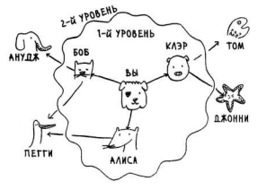

###Сложность алгоритма O()
* Показывает **количество операций**, необходимое для решения задачи с помощью алгоритма

###Массивы
* Элементы располагаются в стоящих друг за другом ячейках памяти, одним куском
* **Чтение O(1)** т.к. известно расопложение всех элементов
* **Вставка O(n)** т.к. в худшем случае придется переместить(или сдвинуть) все старые элементы в такое место, 
чтобы их можно былорасположить одним куском вместе с новым вставляемым
* **УдалениеO(n)** т.к. в худшем случае придется сдвинуть вверх остальные элементы

###Списки
* Элементы располагаются в произвольных ячейках памяти, каждый из них хранит ссылку на следующий
* **Чтение O(n)** т.к. в худшем случе, чтобы прочесть последний элемент, придется пройти до него по ссылкам от 
первого
* **Вставка O(1)** т.к. для этого достаточно поменять одну ссылку на вставляемый элемент
* **УдалениеO(1)** т.к. достаточно изменить ссылку в предыдущем элменте

###Разделяй и властвуй
* Определить базовый(простейший) случай для решений задачи
* Поделить всю задачу на базовые случаи

###Быстрая сортировка
* В **худшем случае(отсортированный массив)**, алгоритм имеет сложность **O(n^2)**, т.к. рекурсивные вызовы
функции сортировки каждый раз обратаывают массив из n элементов. Понятно, что каждый раз на 1 элемент меньше
(n, n-1, ..., n-(n-1)), но константы в данном случае не учитываются
* Для эффективного использования алгоритма следует на каждоый итерации опорным выбирать случайный элемент
* В лучшем случае сложность составит O(n*log_n)
* **Лучший случай = средний случай!**

###Графы, поиск в ширину
* Проверка **всех** узлов графа
* Узлы проверяются в порядке возрастания расстояния между ними: 1 уровень, 2, ..., n. Это гарантирует, что 
первый найденный путь из точки А в точку Б будет являться кратчайшим.

    

* Стек FIFO(first in first out), очередь LIFO(last in first out)
* Виды графов:
  * Направленный - отношения действуют в одну сторону, 1ая вершина соседняя 2ой, но 2ая не соседняя 1ой.
  * Ненаправленный - отношения действуют в обе стороны, 1ая вершина соседняя 2ой, 2ая соседняя 1ой. 